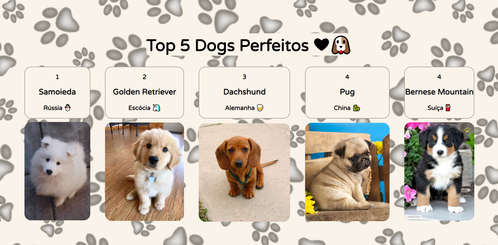

# React I :tada:
## Projeto desenvolvido na 14ª Semana de aulas do curso de Desenvolvimento Web Front-End da 10ª Turma da Reprograma :purple_heart:

---
### :dart: Objetivos 

Criar um projeto React, criar e exportar internamente um arquivo que simula um JSON, criar componentes que importem o arquivo JSON para satisfazer as requisições do projeto, além de renderizar tudo perfeitamente na tela.

---
### :books: Principais aprendizados

* O que é React e sua história
* Conceitos de Biblioteca e Framework
* Dicionário de termos importantes usados no React
* Criação e arquitetura de um projeto React 
* Props, children
* Modularização
* Prática propriamente dita do React
* React é ótimo, muito mais fácil de programar usando a sua lógica estrutural e dinâmica eficiente

---
### :robot: Tecnologias 

- HTML 5
- CSS3
- JavaScript
- React.js
- Node.js

---
### ✔️ Resultado

